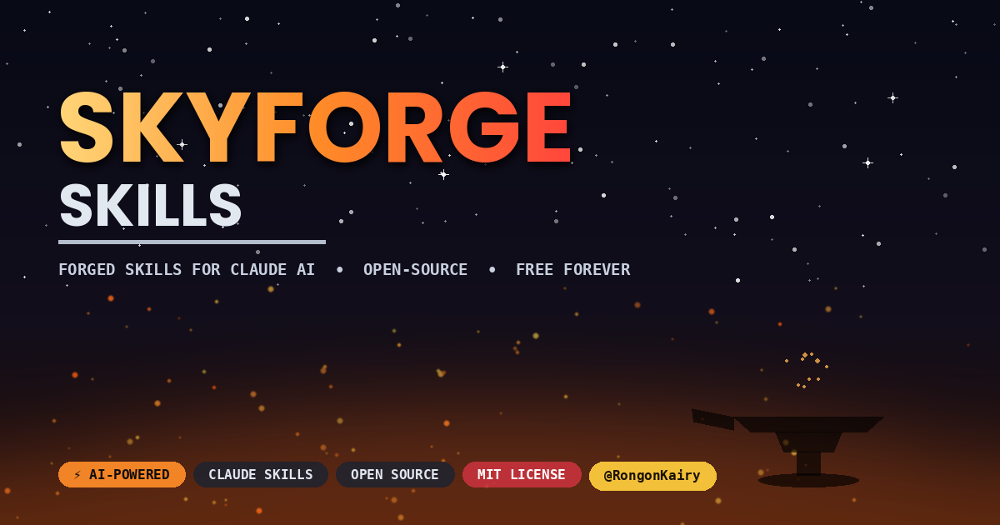

# ⚡ SkyForge Skills — Claude AI Skill Library

<p align="center">
  
</p>

<p align="center">
  
  
  
  
  
  
</p>

<p align="center">
  <b>A growing library of ready-made Skills for Claude AI — content creation, social media growth, freelancing, and automation.<br>
  Drop them into Claude and it instantly knows how you want each task done.<br>
  Completely free, forever.</b>
</p>

<p align="center">
  <a href="https://github.com/RongonKairy/SkyForge-Skills/releases"><b>📥 Download Latest Release</b></a> •
  <a href="https://github.com/RongonKairy/SkyForge-Skills/issues"><b>🐛 Report an Issue</b></a> •
  <a href="https://www.youtube.com/@RongonKairy"><b>🎬 Tutorials on YouTube</b></a>
</p>

---

## ✨ Features

- ⚡ **Ready-to-Use Skills** — drop a folder in, and Claude instantly follows your exact workflow
- 🎬 **Content Creator Tools** — video upload formatting, SEO titles/tags, channel intake & memory
- 📱 **Social Growth Skills** — cross-platform content packages for YouTube, Facebook, Instagram, X, Telegram
- 💼 **Freelance & Outreach Skills** — proposal generation, lead research, client messaging
- 🧠 **Self-Documenting** — every skill ships with a clear `SKILL.md` describing exactly when and how Claude should use it
- 🔓 **No Code Required** — skills are plain markdown + optional templates, nothing to install or compile
- 🌍 **Works Everywhere Claude Works** — Claude.ai (web/mobile/desktop), Claude Code, Claude Cowork
- 🆓 **100% Free & Open Source** — MIT licensed, fork it, remix it, ship it

---

## 📱 Where These Skills Work

| Surface | Support | How to Use |
|---|---|---|
| 🌐 Claude.ai (Web) | ✅ Full Support | Add the skill in your Claude settings |
| 💻 Claude Desktop | ✅ Full Support | Same skills folder, synced automatically |
| 📱 Claude Mobile (iOS/Android) | ✅ Full Support | Skills you've added work on the go |
| ⌨️ Claude Code | ✅ Full Support | Drop the skill folder into your skills directory |
| 🧑‍💻 Claude Cowork | ✅ Full Support | Works as a shared team skill |

> 💡 **No install needed for most surfaces!** Just add the `SKILL.md` folder wherever Claude's skill/capability settings let you upload one.

---

## 🧩 Available Skills

| Skill | Description |
|---|---|
| 🎬 **Viral PRO** | Channel intake + a ready-to-copy "Video Upload Format" (title, description, tags, SEO alternatives, platform links) generated from your saved channel details |
| 📣 **Social PRO** | Cross-platform growth: channel/profile intake, competitor & viral-video analysis, content ideas, and SEO/GEO/AEO-optimized titles, descriptions, tags & hashtags for every platform at once |
| *Advanced Copy Editor** | Grammar, punctuation, style, clarity, and readability pass on any text  |
| 🎯 **coming soon** | coming soon |
| ✍️ **coming soon** | coming soon |
| _More coming soon_ | New skills are added regularly — watch this repo for updates |

---

> When you run **Social PRO** or **Viral PRO** for your own channel, it asks for *your* links and niche the same way — the table above is simply this repo's own maintainer profile, used as the reference example.

---

## 🚀 How to Get Started

### Step 1 — Grab a Skill
👉 Browse the folders above, or [**download the latest release**](https://github.com/RongonKairy/SkyForge-Skills/releases).

### Step 2 — Add It to Claude
Open Claude's skill/capability settings (Claude.ai, Claude Code, or Cowork) → upload the skill's folder (the one containing `SKILL.md`).

### Step 3 — Just Ask
Start a normal conversation and describe what you need — Claude reads the skill's trigger conditions and uses it automatically. No special commands required.

### Step 4 — Personalize Once
For skills like **Social PRO** / **Viral PRO**, fill in the intake questionnaire the first time — Claude saves your details and reuses them in every future request.

---

## 💻 Clone This Repo (Optional)

```bash
git clone https://github.com/RongonKairy/SkyForge-Skills.git
```

> Cloning is only needed if you want to browse, edit, or contribute skills locally — you can also just download individual skill folders from a release.

---

## ❓ FAQ

**Q: Do I need to code anything to use a skill?**
> No. A skill is just a `SKILL.md` markdown file (plus optional templates) — Claude reads it directly.

**Q: Will Claude "send" my details to Google or other AI tools?**
> No. Skills like Social PRO/Viral PRO save your details in **Claude's own memory** so Claude remembers them across chats — that's separate from Google or any other product.

**Q: Can I use these skills on mobile?**
> Yes — any skill added to your account works across Claude.ai web, desktop, and the mobile apps.

**Q: Can I edit a skill for my own niche?**
> Absolutely — every `SKILL.md` is plain markdown. Fork the repo, edit the file, and re-add it.

**Q: Is this really free?**
> Yes, 100% free and MIT licensed — use, modify, and share.

---

## 🤝 Contributing

Found a bug or want to add your own skill? Open an [issue](https://github.com/RongonKairy/SkyForge-Skills/issues) or submit a pull request.

---

## 📜 License

This project is licensed under the **MIT License** — free to use, share, and modify. See [LICENSE](LICENSE) for details.

---

## 👨‍💻 Made by

**Rongon Kairy** — [@RongonKairy](https://github.com/RongonKairy)

> ⭐ If you find these skills useful, please give this repo a **star** on GitHub!
